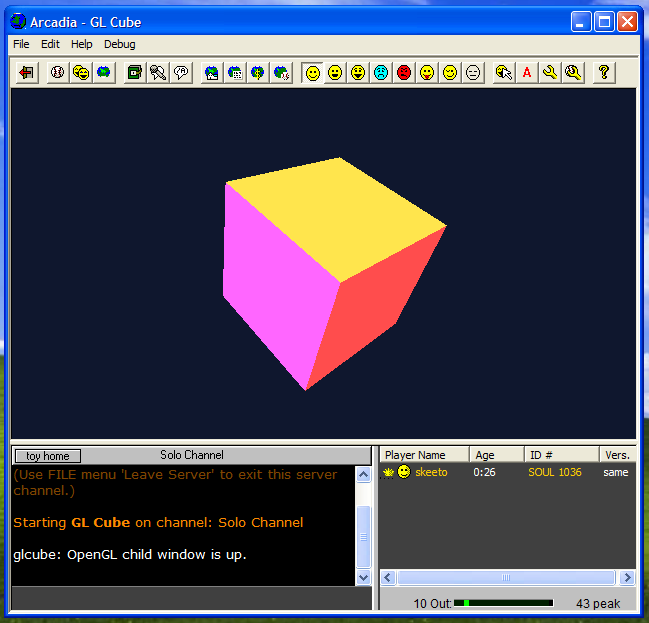

# Arcadia Toy SDK

Build and run your own **toys** (mini-game plugins) for Synthetic Reality's
[Arcadia][] — the multiplayer game shell that shipped with a fixed catalog of
downloadable toys (synPool, synChess, Empyrion, synSpace, …) and was never
opened up for third-party development.



Arcadia loads each toy as a 32-bit DLL that exports six `MP*` functions and
talks to the host through a single dispatch callback. This SDK gives you:

* a clean **C API** (`arcadia/toy.h`) — implement a few callbacks, ignore the
  binary handshake;
* a small **runtime** that provides the six exports and marshals to/from the
  host dispatch;
* **CMake tooling** (`add_arcadia_toy()`) that builds the DLL *and* generates
  the `toy.ini` / `version.ini` and the installable folder layout;
* a fully reverse-engineered **ABI reference** (`docs/ABI.md`) and the RE
  scripts used to recover it (`re/`);
* working **sample toys** — `samples/hello` (2-D GDI, chat, live networking) and
  `samples/glcube` (a hardware-accelerated OpenGL cube in a child window).

No MFC and no Arcadia import library are needed — a toy is plain C.

> Status: the ABI was recovered by static analysis of `Arcadia.exe` (Dec 2007)
> and the twelve shipped toys. The plugin handshake, host dispatch table,
> persistence, players, and surface/drawing calls are well understood; a handful
> of rarely-used host selectors and GED event codes are still marked
> provisional in `docs/ABI.md`. Where the SDK is unsure it says so and always
> lets you fall back to the raw `ar_host()` call.

## Requirements

* [w64devkit][] (x86), or any **32-bit** Windows C toolchain. Arcadia and
  every toy are `pei-i386`, so toys must be 32-bit too. This repo is set
  up for **i686-w64-mingw32**.
* **CMake ≥ 3.16** and a generator (Ninja or Make).

## Quickstart

Build the SDK and the sample toy:

```sh
cd sdk
cmake -B build -G Ninja \
      -DCMAKE_TOOLCHAIN_FILE=cmake/toolchain-i686-w64-mingw32.cmake
cmake --build build
```

The staged, installable toy appears in `build/toys/toy13/` (the folder is named
`toy<NUMBER>` — see below):

```
build/toys/toy13/
  Hello.dll       # the toy (32-bit, exports the six MP* functions)
  toy.ini         # generated: name/desc/dll/preview
  version.ini     # generated: version
```

Copy that folder into your Arcadia install as `Arcadia/Toys/toy13/` (or use the
`_deploy` target, below) and launch Arcadia. It appears in the "Select Toy"
list automatically — Arcadia rescans the `Toys\` directory each time.

> **Folder naming matters.** Arcadia only loads a toy whose folder is named
> `toy<N>` with `N` a positive integer (it computes `atoi(folderName+3)` and
> skips anything ≤ 0). `N` is the toy's identity and registry slot; the 12
> official toys use 1–12, so pick **N ≥ 13**. This is why `add_arcadia_toy()`
> requires a `NUMBER` and names the folder for you. Verified against the
> shipped Arcadia.exe.

If your mingw is not on `PATH`, point the toolchain at it:

```sh
cmake -B build -G Ninja \
  -DCMAKE_TOOLCHAIN_FILE=cmake/toolchain-i686-w64-mingw32.cmake \
  -DARCADIA_MINGW_PREFIX="$HOME/w32devkit/bin"
```

## Writing a toy

Copy `samples/hello` and edit two files.

**`hello.c`** — implement `ArcadiaToyRegister` and the callbacks you want:

```c
#include <arcadia/toy.h>

static void on_paint(ArContext *ctx, HDC dc) {
    RECT rc; GetClientRect(ar_window(), &rc);
    HBRUSH b = CreateSolidBrush(RGB(16,24,48));
    FillRect(dc, &rc, b); DeleteObject(b);
    TextOutA(dc, 12, 10, "my toy", 6);
}

void ArcadiaToyRegister(ArToy *toy) {
    toy->name  = "MyToy";
    toy->paint = on_paint;      // SDK double-buffers this onto the canvas
    // toy->open / tick / packet / serialize / chat / player_event ...
}
```

**`CMakeLists.txt`** — describe the toy; the ini files and layout are generated:

```cmake
list(APPEND CMAKE_MODULE_PATH "/path/to/sdk/cmake")
include(ArcadiaToy)

add_arcadia_toy(mytoy
    NAME     "MyToy"
    NUMBER   13             # folder becomes toy13; use an unused N >= 13
    DESC     "What it does"
    VERSION  "0.0001"
    SOURCES  mytoy.c
    # PREVIEW mytoy.jpg      # optional thumbnail
    # ASSETS  sfx art        # optional folders copied into the layout
)
```

### The callback model (`ArToy`)

| Callback        | Fires on                            | Notes |
|-----------------|-------------------------------------|-------|
| `open`          | `MPOpenOffer` (session start)       | you get the canvas `HWND` |
| `close`         | `MPCloseOffer` (session end)        | free your resources |
| `tick`          | per-frame update (~32 Hz, GED 0x6)  | update game state (SDK paints after) |
| `paint`         | after each tick                     | draw into a double-buffered DC |
| `serialize`     | host wants your outgoing snapshot (GED 0x08) | fill `buf`, return length |
| `packet`        | `MPIncomingPacket`                  | a peer's payload arrived |
| `chat`          | chat/system line (GED 0x0e)         | best-effort |
| `player_event`  | player joined/acted (GED 0x0f)      | best-effort |
| `ged`           | every host event, first             | raw escape hatch |

Everything else is a normal function you can call anytime the session is open:
`ar_print` (chat), `ar_send`/`ar_flush` (networking), `ar_play_sound`/
`ar_play_music`/`ar_stop_sounds` (audio), `ar_local_player_id`,
`ar_get_player_info`, `ar_store_read/write`, `ar_reg_get/set`, the
`ar_surface_*` family (create/load/fill/save/blit/pixels), `ar_key_down`,
`ar_mouse`, and the raw `ar_host(selector, …)`. See `include/arcadia/toy.h`
and `docs/ABI.md`.

**Text & fonts.** There's no text helper by design — draw with GDI on the paint
DC. You can use Arcadia's own faces for free: the host registers `Castellar`
(via `AddFontResource`) and `Verdana` is a system font, both available to your
toy's `CreateFont`/`TextOut`. Details in `docs/ABI.md` §8.

**Audio & assets.** Put `.wav` files in your toy's `sfx/` folder and `.mid` in
`midi/` (like the shipped toys), then `ar_play_sound("thing.wav")` — the host
resolves names against your toy folder. See `docs/ABI.md` §7.

**Networking in one paragraph.** For discrete events (a move, a shot), call
`ar_send(channel, data, len)` — every peer gets it via your `packet()` callback.
For authoritative state that new/joining players need, fill it in `serialize()`
and call `ar_flush()` when it changes; the host pulls and transmits it. Both are
host-mediated — no sockets. Payloads are binary-safe (the host applies a
lossless RLE+escape codec). Details and the wire path in `docs/ABI.md` §3.1–3.2.

### Testing multiplayer on one machine

Arcadia allows one serial number per install, so two clients need two installs.
Verified recipe (see `docs/ABI.md` §3.1 for the full writeup):

1. Copy your Arcadia folder to a second location (a fresh copy mints its own
   serial on first run) and drop your `toy<N>` folder into its `Toys/`.
2. In install A: Multiplayer → "TELNET – Generic TCP/IP" → Play Game →
   **Wait For Call** (listens on TCP 8000; it prints the IPs to dial).
3. In install B: Multiplayer → "TELNET – Generic TCP/IP" → Play Game →
   Address Book → add `<host-ip>:8000` → **Connect** → Play Game.
4. Load your toy in both. `ar_send()` payloads now round-trip through each
   peer's `packet()` callback. No MIX server or master server required.

For a full **MIX** session instead of point-to-point (channels, the server
browser, more than two players), see the bonus **`tools/mixserver`** — a small
Go program that stands in for Synthetic Reality's whole MIX backend (master +
game servers + `synreal.ini`) on your own machine. Patch each client's
`SRNet.dll` to fetch `synreal.ini` from your server and pick "Any Public MIX
Game Server". Its README documents the reverse-engineered MIX protocol.

### Using the SDK from another project (FetchContent)

The SDK is designed to be vendored into your own toy repo. Pull it in and call
`add_arcadia_toy()` directly — the runtime target and the helper come with it,
and its bundled samples are not built when it's a subproject:

```cmake
cmake_minimum_required(VERSION 3.16)
project(my_toy C)

include(FetchContent)
FetchContent_Declare(arcadia_sdk
    GIT_REPOSITORY https://github.com/skeeto/arcadia-sdk.git
    GIT_TAG        main)          # or a release tag
FetchContent_MakeAvailable(arcadia_sdk)

add_arcadia_toy(mytoy
    NAME "MyToy" NUMBER 13 VERSION "0.0001" SOURCES mytoy.c)
```

Configure your project with the 32-bit toolchain (a toolchain file must be set
at first configure, before content is fetched, so reference a local copy):

```sh
cmake -B build -G Ninja \
      -DCMAKE_TOOLCHAIN_FILE=path/to/toolchain-i686-w64-mingw32.cmake
```

The SDK ships that toolchain file under `cmake/`; copy it into your repo (or
point `CMAKE_TOOLCHAIN_FILE` at your own 32-bit toolchain / MSVC `-A Win32`).

### Deploying to a local Arcadia for testing

```cmake
install_arcadia_toy_to(mytoy "C:/path/to/Arcadia")
# then:  cmake --build build --target mytoy_deploy
```

or `cmake --install build --prefix <ArcadiaDir>` (drops toys under `Toys/`).

## Repository layout

```
sdk/
  include/arcadia/toy.h     public C API
  src/arcadia_toy.c         SDK runtime (the six exports + wrappers)
  src/arcadia_toy.def       export list
  cmake/
    ArcadiaToy.cmake        add_arcadia_toy(), runtime target
    toolchain-i686-w64-mingw32.cmake
    toy.ini.in, version.ini.in
  samples/hello/            2-D GDI sample + template CMakeLists
  samples/glcube/           OpenGL cube in a child GL window (threaded, drag to rotate)
  docs/ABI.md               reverse-engineered binary spec
  re/                       RE tooling (capstone/pefile) + raw evidence
  tools/mixserver/          all-in-one MIX test server (Go) for local multiplayer
```

## How the ABI was recovered

See `docs/ABI.md` for the full spec and `re/tools/` for the scripts (they run in
the `re/.venv` virtualenv). In short: every toy exports the same six `__cdecl`
functions; `MPRegisterCallback` receives one pointer — the host's dispatch
function at `Arcadia.exe` RVA `0x17b94`, a 68-entry jump table over selectors
`0x09..0x4c`. Decoding that switch (`re/out/handlers.txt`) yields the entire
host API. `MPSendGEDMessage` is the reverse channel: the host's event pump into
the toy.

## License / provenance

*Arcadia*, the toy binaries, and the name "Synthetic Reality" belong to their
author. This SDK is an independent, clean-room-style interoperability effort:
it contains no host code, only a description of the interface and original code
that speaks it. Use it to make toys, not to redistribute the host.


[Arcadia]: http://www.synthetic-reality.com/arcadia.htm
[w64devkit]: https://github.com/skeeto/w64devkit
